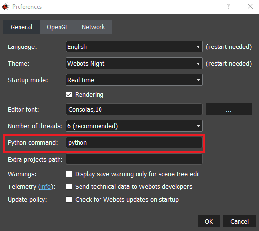
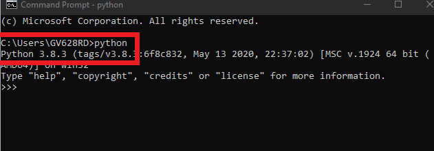
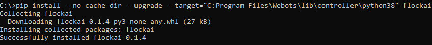
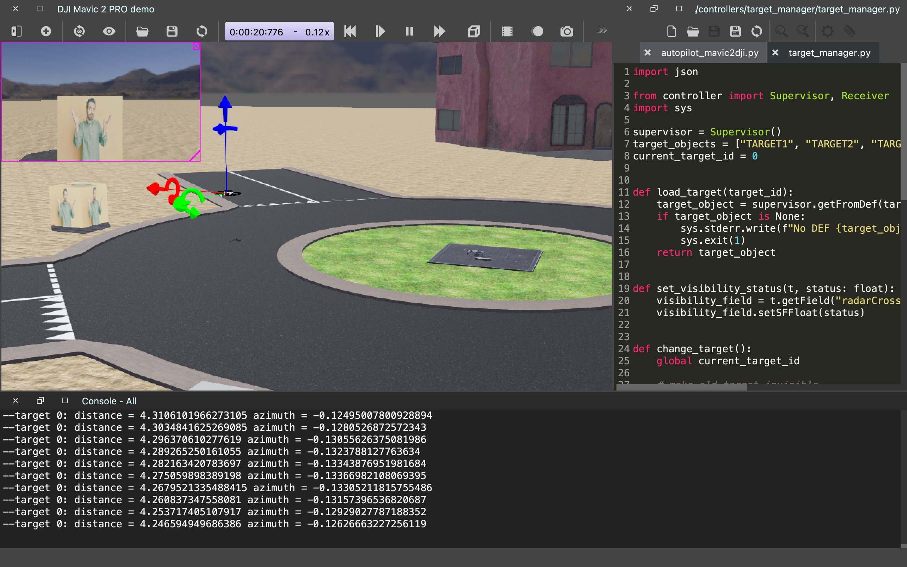

# FlockAI - A Framework for Rapidly Testing ML-Driven Drone Applications
FlockAI, an open and modular by design framework supporting users with the rapid deployment and repeatable testing during the design phase of ML-driven drone applications.

FlockAI can be used to design drone testbeds with "ready-to-go" drone templates, deploy ML models, configure on-board/remote inference, monitor and export drone resource utilization, network overhead and energy consumption to pinpoint performance inefficiencies and understand if various trade-offs can be exploited. 

Find out more about FlockAI by simply visiting our [website](https://unic-ailab.github.io/flockai/).

## Installing Webots Robotics Simulator
FlockAI currently features integration endpoints with the Webots robotics simulator. Therefore, to use FlockAI, Webots must be previously installed on your computing environment. 

The installation of process of Webots is pretty straightforward for any OS environment (Linux, macOS, Windows) and instructions can be found [here](https://cyberbotics.com/doc/guide/installing-webots).

Note: FlockAI requires a version of Webots above *R2021a* and we recommend using version **R2021a** where all offered tests and simulations worlds have been tested for. You can select versions from [here](https://github.com/cyberbotics/webots/releases)

## Installing FlockAI and Webots Endpoints
Before we download dependencies and FlockAI, make sure that pip is up-to-date (>22.x) and that Cmake is [installed](https://cmake.org/install/).

Integrating FlockAI with Webots requires the FlockAI controllers to be placed in the respected Python environment of Webots. We have made this process easy and requires only the following steps:

### Checking installed python version
Upon launching Webots navigate to `Tools->Preferences` and identify the command that Webots uses to run its python controllers.

Then, launch a terminal (or command prompt) and type the same command to identify your default python version.

After the version is identified, the corresponding Webots controller directory needs to be noted down.

### Identifying Webots controller directory
Navigate to the directory that Webots was installed and copy the corresponding controller path to your clipboard.

Once the controller path is copied, flockai should be installed in to that directory

### Installing FlockAI to the Webots controller directory
Run the following command and make sure webots is installed in the destination directory

`pip install --no-cache-dir --upgrade --target="your/webots/controller/directory" flockai`

## Download FlockAI Sample Worlds and Tests from Git Repo

### Clone the FlockAI repo on your system

`git clone https://github.com/unic-ailab/flockai-working.git`

### Install requirements

Navigate to the installed folder  and execute the following command to install python requirements

`pip install -r requirements.txt`

### Open one of the sample worlds located in the simulation directory

In Webots, navigate to `File->Open World` and load one of the sample worlds our team has developed

#### Load sample controllers on your robots

Check the relevant documentation on each controller to make the appropriate changes on your world's objects

## Give FlockAI a Go and Have Fun!
	1. Keyboard-Based Navigation
	2. Autopilot Navigation
	3. ML sensor value prediction with linear regression
	4. Face detection with deep learning
	5. Crowd detection
	6. and more!

## Even Simpler Installation and Updating Process
To make the installation and updating process even simpler, FlockAI now features a python wheel for easy deployment.
First, open the `environmental_variables.txt` file and update the `WEBOTS_PYTHON_PATH` to where your python controller of Webots is (see above). Next, just use `make` for the rest.

### To update FlockAI:
`
make all
`

### First time setup:
`
make requirements
`
### Package build download and install:
`
make package
`
`
make install
`
or simply just use... 
`
make all
`

