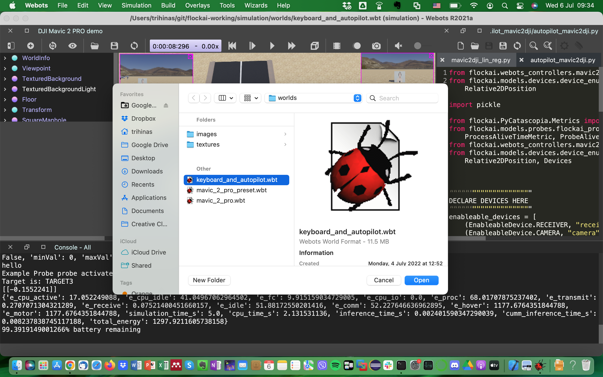
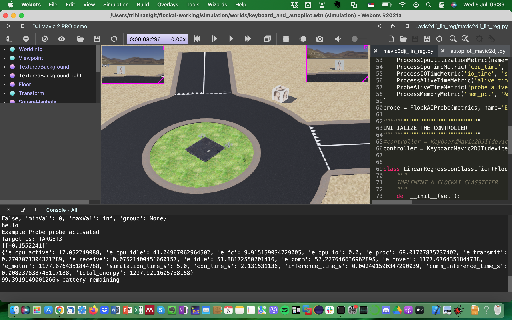
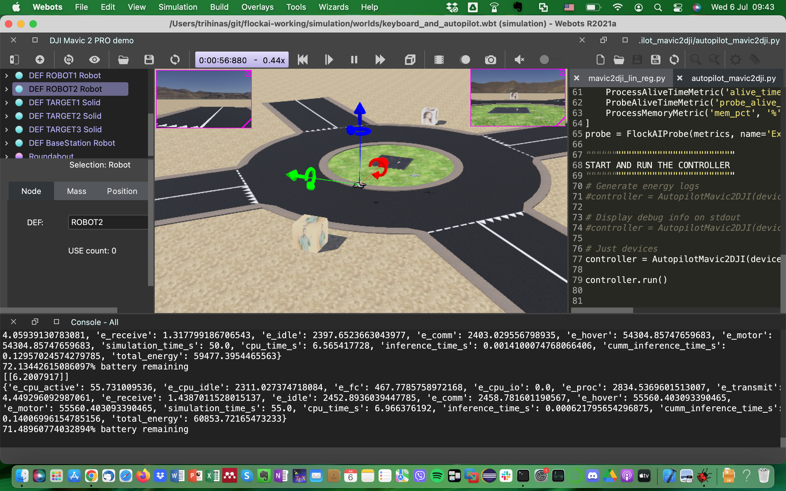
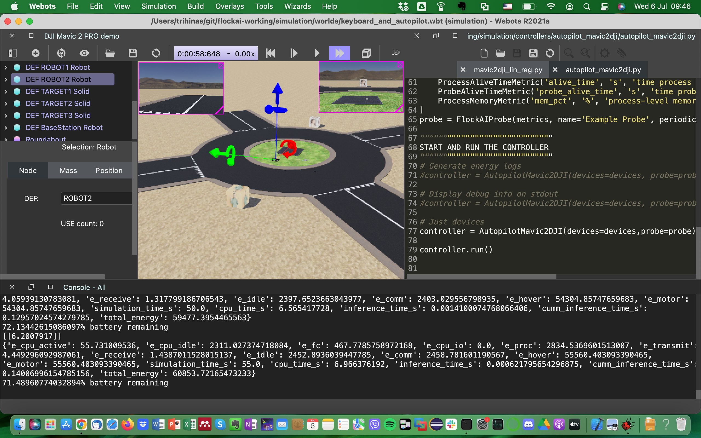

# FlockAI Demo

Note: this demo was created to showcase the FlockAI feature set during the IEEE ICDCS 2022 conference, held in Bologna, Italy (July 2022).

## Step 0: Prerequisites
Install Webots and FlockAI on your environment. If you dont have a running installation of FlockAI then take a look at our getting started guide [here](https://github.com/unic-ailab/flockai-working/)

## Step 1: Download Simulation World
If your FlockAI git repo is up-to-date then you already have the required simulation world on your environment but if not, simply do a quick `git pull` to make sure the `keyboard_and_autopilot.wbt` world is downloaded locally.

## Step 2: Load the Simulation World
After downloading the simulation world, simply `File->Open World` and navigate to the simulation world found in your local FlockAI git repo.

## Step 3: Give the Simulation a Go!
The simulation starts with two drones pre-configured and ready to go! 

Drone 1 is keyboard navigated and upon simulation start it just takes-off and hovers until you decide to move it as you please. While you do so, monitoring data is being collected and printed to the console. In turn, a linear regression model is loaded and it performs inference using dummy temperature and humidity data.

Drone 2 is in autopilot mode and upon simulation start it takes-off. Navigation is controlled by performing face-recognition on targets that have been randomly placed in the simulation world. When the drone finds a face it navigates towards it automatically! In the default setting, navigation data is printed on the console.

## Step 4: Configure as you wish the simulation!
Now that everything is running and you took the drones for a spin :) you may configure as you wish the simulation. Configuration includes persistently storing the data, changing ML models (i.e., LR to CNN), seeing debuging information, adding/removing monitoring probes, adding/removing sensors.

To make things easier, the controllers of this world have commented out configurations.

## Citation
**Demo: FlockAI - A Framework for Rapidly Testing ML-Driven Drone Applications**. Trihinas, D.; Agathocleous, M.; and Avogian, K. In 2022 IEEE 42nd International Conference on Distributed Computing Systems (ICDCS), 2022.
